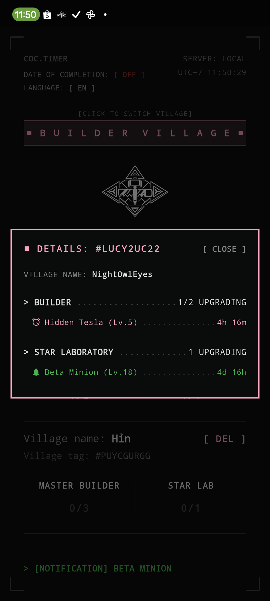
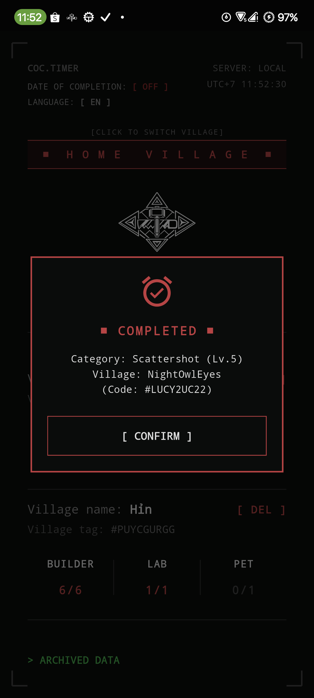

  <a href="README.md">English</a> | <a href="README-vi.md">Tiếng Việt</a>

  

  

# COC Timer

An app for tracking upgrade timers for buildings, spells, troops, pets, and more in Clash of Clans, with a built-in reminder/alarm system for when they finish.

## Features

The app supports **3 reminder modes** for each item:

| Mode | Description |
|---|---|
| 🔕 No notification | No reminder when the upgrade finishes |
| 🔔 Notification reminder | Sends a regular system notification when finished |
| ⏰ Alarm | Rings and shows a full-screen popup like a real alarm, even when the device is locked |

## How to use

1. In the game, go to **Settings** > **More Settings** > **Export village data as JSON**
2. Open the COC Timer app
3. Scroll down and tap **Paste** to import the JSON data you just exported
4. Tap the **name of any item** to cycle through the 3 reminder modes
5. Tap the **group title** (e.g. Builders, Pets, Laboratory) to change the mode for the **whole group** at once

### Real time

The app has a toggle for how time is displayed:
- **Off**: shows a countdown (e.g. `2h 15m`)
- **On**: shows the actual completion time (e.g. `14:30`)

## Choosing an installation build (ABI)

| ABI | For devices |
|------|-------------------|
| **arm64-v8a** | [⭐Recommended] 64-bit Android devices with ARM CPUs (most phones and tablets from around 2018 onward). |
| **armeabi-v7a** | 32-bit Android devices with ARM CPUs (older Android phones, roughly before 2017–2018). |
| **x86_64** | 64-bit Android devices with Intel/AMD x86 CPUs, mainly used by Android emulators, or a small number of older Intel-based tablets/phones. |

## Screenshots

  
  
  
  

---

## Getting Started

This project is a starting point for a Flutter application.

A few resources to get you started if this is your first Flutter project:

- [Learn Flutter](https://docs.flutter.dev/get-started/learn-flutter)
- [Write your first Flutter app](https://docs.flutter.dev/get-started/codelab)
- [Flutter learning resources](https://docs.flutter.dev/reference/learning-resources)

For help getting started with Flutter development, view the
[online documentation](https://docs.flutter.dev/), which offers tutorials,
samples, guidance on mobile development, and a full API reference.
