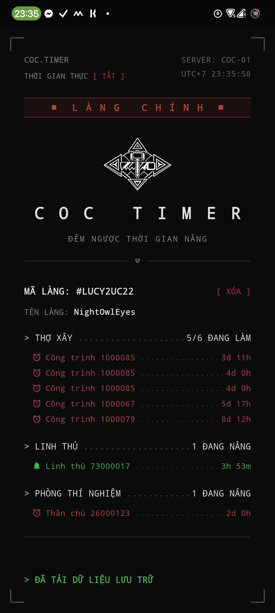
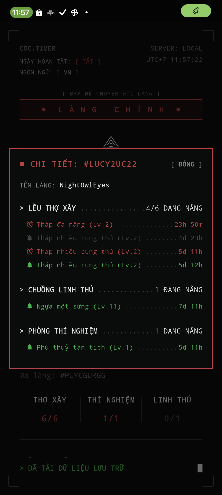
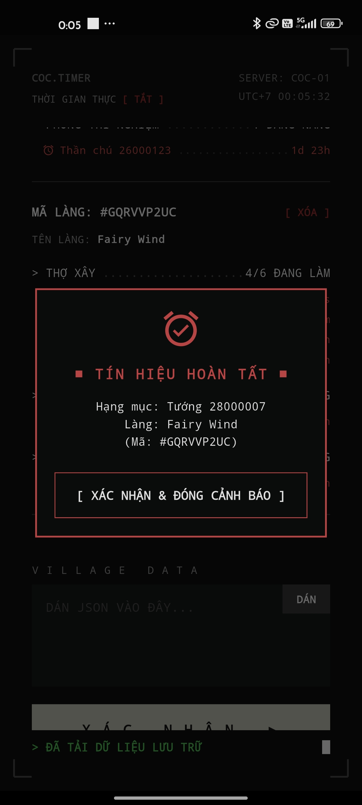

  

# COC Timer

Ứng dụng theo dõi thời gian nâng cấp công trình, thần chú, lính, linh thú... trong Clash of Clans, kèm hệ thống nhắc nhở/báo thức khi hoàn thành.

## Tính năng

Ứng dụng hỗ trợ **3 chế độ nhắc nhở** cho từng hạng mục:

| Chế độ | Mô tả |
|---|---|
| 🔕 Không thông báo | Không nhắc gì khi hoàn thành |
| 🔔 Nhắc nhở bằng thông báo | Gửi thông báo hệ thống thông thường khi hoàn thành |
| ⏰ Báo thức | Phát chuông và hiện popup toàn màn hình như báo thức thật, kể cả khi máy đang khóa |

## Cách sử dụng

1. Vào **Cài đặt game** > **Thêm cài đặt** > **Xuất dữ liệu làng theo định dạng JSON**
2. Mở app COC Timer
3. Cuộn xuống, bấm nút **Dán** để nhập dữ liệu JSON vừa xuất
4. Nhấn vào **tên từng công trình** để chuyển đổi qua lại giữa 3 chế độ nhắc nhở
5. Nhấn vào **tên tiêu đề nhóm** (VD: Thợ xây, Linh thú, Phòng thí nghiệm) để chuyển đổi chế độ **hàng loạt** cho cả nhóm

### Thời gian thực

Ứng dụng có công tắc bật/tắt hiển thị thời gian:
- **Tắt**: hiển thị dạng đếm ngược (VD: `2h 15m`)
- **Bật**: hiển thị thời gian hoàn thành thực tế (VD: `14:30`)

## Ảnh chụp màn hình

  

  
  
  

---

## Getting Started

This project is a starting point for a Flutter application.

A few resources to get you started if this is your first Flutter project:

- [Learn Flutter](https://docs.flutter.dev/get-started/learn-flutter)
- [Write your first Flutter app](https://docs.flutter.dev/get-started/codelab)
- [Flutter learning resources](https://docs.flutter.dev/reference/learning-resources)

For help getting started with Flutter development, view the
[online documentation](https://docs.flutter.dev/), which offers tutorials,
samples, guidance on mobile development, and a full API reference.
